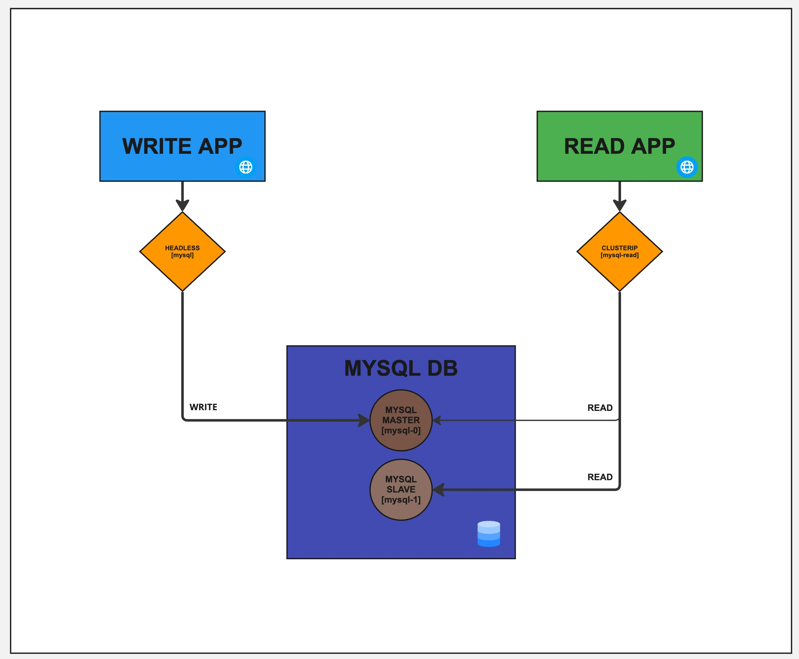

# Understanding Kubernetes Headless Services

## Introduction
This project demonstrates Kubernetes Headless Services using a real-world PostgreSQL primary-replica setup. It shows how Headless and ClusterIP services work together for database write/read separation.

## What is a Headless Service?
A regular Kubernetes Service gives you one IP that load balances across pods. A **Headless Service** is different — it has no ClusterIP. Instead, DNS returns the IP of every pod behind the service.

**Why is this useful?** When you need to talk to a *specific* pod — like a database primary — you need its direct address, not a load balancer.

Key points:
- `clusterIP: None` makes it headless
- DNS returns all pod IPs (not one service IP)
- Each pod gets its own DNS: `<pod-name>.<service-name>.<namespace>.svc.cluster.local`

## Architecture Overview

<div align="center">
  
</div>

> **Note:** In the latest update, MySQL has been replaced with PostgreSQL.


### How Both Services Work Together

| Service | Type | Purpose | DNS Returns |
|---------|------|---------|-------------|
| `postgres` | Headless (`clusterIP: None`) | Direct pod access for writes | Individual pod IPs |
| `postgres-read` | ClusterIP | Load-balanced reads | Single service IP |

- **Write App** → connects to `postgres-0.postgres` (headless) → always hits the primary
- **Read App** → connects to `postgres-read` (ClusterIP) → load balanced across both pods

## Components

### PostgreSQL StatefulSet (2 replicas)
- `postgres-0`: Primary — handles all writes
- `postgres-1`: Replica — streams data from primary, serves reads
- Replication: PostgreSQL built-in streaming replication

### Write Application (Port 30000)
- Connects to `postgres-0.postgres` via headless service
- Registers users (INSERT operations)
- Environment Configuration:
  - DB_HOST: postgres-0.postgres
  - DB_USER: appuser
  - DB_PASSWORD: password123
  - DB_NAME: userdb

### Read Application (Port 30001)
- Connects to `postgres-read` ClusterIP service
- Reads users (SELECT operations, load balanced)
- Environment Configuration:
  - DB_HOST: postgres-read
  - DB_USER: appuser
  - DB_PASSWORD: password123
  - DB_NAME: userdb

## Directory Structure
```
├── kubernetes/
│   ├── postgres-statefulset.yaml   # StatefulSet + both Services
│   ├── write-app.yaml              # Write app Deployment + NodePort
│   └── read-app.yaml               # Read app Deployment + NodePort
├── write-app/
│   ├── app.py
│   ├── index.html
│   ├── requirements.txt
│   └── Dockerfile
└── read-app/
    ├── app.py
    ├── index.html
    ├── requirements.txt
    └── Dockerfile
```

## Quick Start

### Prerequisites
- Kubernetes cluster
- kubectl configured
- A default StorageClass (see below)
- Node ports 30000 and 30001 available

### Setting Up Dynamic Volume Provisioning

For the PostgreSQL StatefulSet to work properly, you need a functioning storage class for dynamic volume provisioning. This demo uses Persistent Volume Claims (PVCs) which require either manually created Persistent Volumes or a storage provisioner.

#### Using OpenEBS for Local Storage

OpenEBS provides an easy way to set up dynamic volume provisioning for local volumes, which is perfect for development and testing environments.

#### Install OpenEBS

1. Add the OpenEBS Helm repository:
```bash
helm repo add openebs https://openebs.github.io/charts
helm repo update
```

2. Install OpenEBS (without Mayastor for simplicity):
```bash
helm install openebs --namespace openebs openebs/openebs \
  --set engines.replicated.mayastor.enabled=false \
  --create-namespace
```

3. Verify the installation:
```bash
kubectl get pods -n openebs
```

#### Set OpenEBS hostpath as Default Storage Class

1. Check your current storage classes:
```bash
kubectl get storageclass
```

2. Make OpenEBS hostpath the default storage class:
```bash
# First, unset the default flag on your current default storage class (if any)
kubectl patch storageclass <current-default-storage-class> -p '{"metadata": {"annotations":{"storageclass.kubernetes.io/is-default-class":"false"}}}'

# Then set OpenEBS hostpath as the default
kubectl patch storageclass openebs-hostpath -p '{"metadata": {"annotations":{"storageclass.kubernetes.io/is-default-class":"true"}}}'
```

3. Verify the changes:
```bash
kubectl get storageclass
```
You should see openebs-hostpath marked as default (with "(default)" next to its name).

4. Update your PVCs to use the new storage class:
If you've already defined PVCs in your YAML files, you can either:
- Remove the `storageClassName` field to use the default
- Explicitly set `storageClassName: openebs-hostpath`

#### Alternative Options

If you're running in a cloud environment:
- AWS: Use `aws-ebs` storage class
- GCP: Use `standard` storage class
- Azure: Use `managed-premium` storage class

For production use cases, consider using more robust storage solutions like Ceph, Portworx, or cloud-native volume solutions.

### Installation Steps

```bash
# Deploy PostgreSQL (StatefulSet + Services)
kubectl apply -f kubernetes/postgres-statefulset.yaml

# Wait for both postgres pods to be ready
kubectl get pods -w

# Deploy applications
kubectl apply -f kubernetes/write-app.yaml
kubectl apply -f kubernetes/read-app.yaml

# Check all pods are running
kubectl get pods

# Verify replication is working
kubectl exec postgres-0 -- psql -U postgres -c "SELECT client_addr, state FROM pg_stat_replication;"

# Verify replica is in read-only mode
kubectl exec postgres-1 -- psql -U postgres -c "SELECT pg_is_in_recovery();"
```

### Testing the Demo

#### Observe DNS Differences
```bash
# Headless service — returns individual pod IPs
kubectl run -it --rm debug --image=busybox --restart=Never -- nslookup postgres

# ClusterIP service — returns single service IP
kubectl run -it --rm debug --image=busybox --restart=Never -- nslookup postgres-read
```

#### Testing Direct Communication
- Access Write App: `http://<node-ip>:30000`
  - Writes always go to postgres-0 (master) via headless service
- Access Read App: `http://<node-ip>:30001`
  - Reads are load balanced across pods

## Key Learning Points

1. **Headless Service** (`clusterIP: None`): Returns individual pod IPs via DNS. Use when you need to reach a specific pod.

2. **ClusterIP Service** (default): Returns one service IP that load balances. Use for normal traffic distribution.

3. **Together**: Headless for writes to the primary, ClusterIP for load-balanced reads — a common real-world database pattern.

## Production Notes
This is a demo. For production:
- Use Kubernetes Secrets for credentials
- Configure proper storage classes
- Use a PostgreSQL operator (like CloudNativePG) for production replication
- Implement backup strategies
